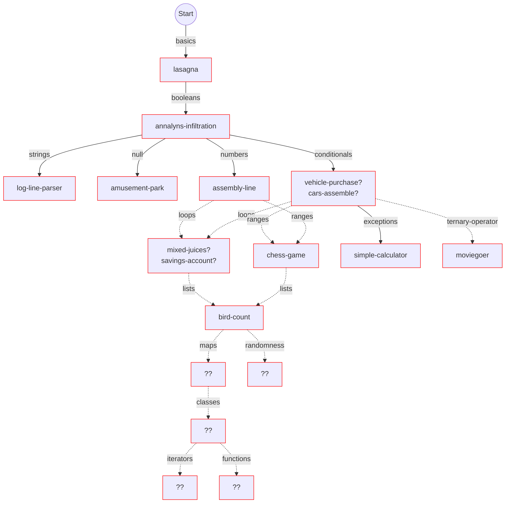

# Concept tree for Wren learning mode

## Some that are already in progress or planned

This is a very fluid plan and will doubtless continue to change frequently!

<!-- Boxes in solid red will almost certainly need a new concept exercise created. 
Others marked `??` with red borders can probably fork something suitable from other tracks (TODO). -->

Boxes with green borders have the exercise + concept PRs submitted.
Solid green means both are merged.

